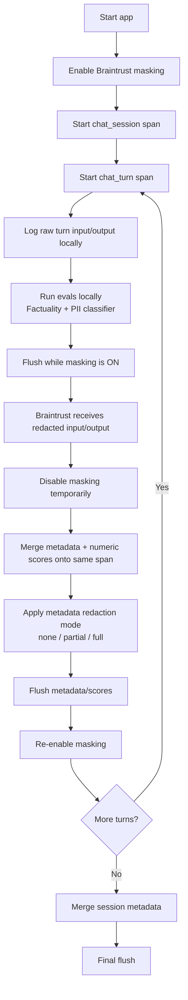

# Banking Assistant Redaction Demo

This CLI demo runs a multi-turn banking assistant, evaluates each turn before upload, and writes a Braintrust trace where raw span `input` and `output` are always redacted before any flush to Braintrust.

## What It Demonstrates

- A multi-turn `chat_session` span with nested `chat_turn` spans
- Pre-upload evals on each turn
- A `Factuality` scorer
- A custom `LLMClassifier` for PII detection
- Configurable metadata redaction modes: `none`, `partial`, `full`
- A single trace tag derived from the selected redaction mode: `redaction:none`, `redaction:partial`, or `redaction:full`

## Redaction Guarantee

The current implementation is structured so unredacted span `input` and `output` are never flushed to Braintrust.

Validated from the code path in [banking_assistant_demo.py](/Users/nick.slavin/repos/redacted-log-evals/banking_assistant_demo.py):

- Global masking is enabled during tracing setup in [banking_assistant_demo.py:227](/Users/nick.slavin/repos/redacted-log-evals/banking_assistant_demo.py#L227) through [banking_assistant_demo.py:249](/Users/nick.slavin/repos/redacted-log-evals/banking_assistant_demo.py#L249).
- Session and turn spans log raw `input` and `output` while masking is still enabled in [banking_assistant_demo.py:372](/Users/nick.slavin/repos/redacted-log-evals/banking_assistant_demo.py#L372) through [banking_assistant_demo.py:388](/Users/nick.slavin/repos/redacted-log-evals/banking_assistant_demo.py#L388) and [banking_assistant_demo.py:437](/Users/nick.slavin/repos/redacted-log-evals/banking_assistant_demo.py#L437) through [banking_assistant_demo.py:444](/Users/nick.slavin/repos/redacted-log-evals/banking_assistant_demo.py#L444).
- The first `flush()` for each turn happens before masking is disabled in [banking_assistant_demo.py:328](/Users/nick.slavin/repos/redacted-log-evals/banking_assistant_demo.py#L328) through [banking_assistant_demo.py:331](/Users/nick.slavin/repos/redacted-log-evals/banking_assistant_demo.py#L331). That is the flush which can carry the raw trace payload, so Braintrust receives the redacted version.
- Masking is disabled only after that first flush, and only to merge metadata and numeric scores in [banking_assistant_demo.py:331](/Users/nick.slavin/repos/redacted-log-evals/banking_assistant_demo.py#L331) through [banking_assistant_demo.py:339](/Users/nick.slavin/repos/redacted-log-evals/banking_assistant_demo.py#L339).
- The session-level metadata merge follows the same pattern in [banking_assistant_demo.py:474](/Users/nick.slavin/repos/redacted-log-evals/banking_assistant_demo.py#L474) through [banking_assistant_demo.py:490](/Users/nick.slavin/repos/redacted-log-evals/banking_assistant_demo.py#L490).
- Autoevals wraps its OpenAI client and creates Braintrust spans for eval model calls, but those spans are still covered by the same global masking function and there is no `flush()` inside Autoevals or the OpenAI wrapper.

What this means in practice:

- Raw trace `input` and `output` are never flushed unredacted.
- Eval requests created by `Factuality` and `LLMClassifier` are also not flushed unredacted.
- Metadata is uploaded in a separate merge after the redacted trace row already exists.
- Metadata redaction is configurable and independent from trace `input`/`output` redaction.

## Upload Flow



## Metadata Redaction Modes

- `none`: metadata is uploaded as-is
- `partial`: only rationale / reasoning-style metadata fields are redacted
- `full`: the full metadata payload is redacted with shape preserved

The app prompts for the mode at startup when running interactively. You can also preconfigure it with `METADATA_REDACTION_MODE`.

## Scoring

Each turn is evaluated before the trace is flushed:

- `factuality`: Braintrust Autoevals `Factuality`
- `pii_detection`: custom `LLMClassifier`

Those numeric scores are merged onto the same Braintrust span in the post-redaction metadata/scores write path.

## FAQ

### If masking is turned off later, why doesn't that leak unredacted data?

In general, it does not leak as long as the unredacted payload is flushed while masking is enabled, and any later writes are limited to safe follow-up fields such as metadata or scores.

The pattern is:

1. Raw `input` / `output` are logged to the span.
2. `flush()` runs while masking is enabled, so Braintrust receives only the redacted version.
3. Masking is then disabled.
4. A new span merge is logged with only `metadata` and `scores`.
5. A second `flush()` sends only that metadata/scores update.

The later flush is not resending the earlier raw trace payload. It is a new merge event on the same span id.

In this example app, that is exactly how the turn flow works: raw chat input/output are flushed first under masking, and only afterward does the app merge metadata and numeric eval scores.

### Does scoring send unredacted data to Braintrust?

Not if scoring happens before flush and the same masking layer remains active for the scoring calls.

A useful way to think about this:

1. A scorer may call another model and may produce its own traced model-call spans.
2. That alone is not a leak.
3. What matters is whether those scoring spans are flushed while masking is still enabled.

In this example, `Factuality` and `LLMClassifier` both make model calls before the app flushes. Those eval calls can create Braintrust spans, but the global masking function is still on at that point, and there is no intermediate `flush()` inside the scoring path. As a result, the eval prompts and eval responses are redacted before upload for the same reason the main chat spans are redacted.

### How is offline scoring different from scoring in Braintrust?

Offline scoring means the application runs the judge locally or in its own runtime before or alongside upload, then writes the resulting scores back onto the trace.

Scoring in Braintrust means the data is already in Braintrust first, and the scoring job runs afterward inside Braintrust-managed infrastructure or workflows.

In this example:

- Offline scoring: the app runs `Factuality` and `LLMClassifier` first, then uploads the redacted trace plus the resulting scores
- Scoring in Braintrust: the app would upload first, and the scoring step would happen later inside Braintrust

## Run

```bash
python -m venv .venv
source .venv/bin/activate
pip install -r requirements.txt
cp .env.example .env
python banking_assistant_demo.py
```
